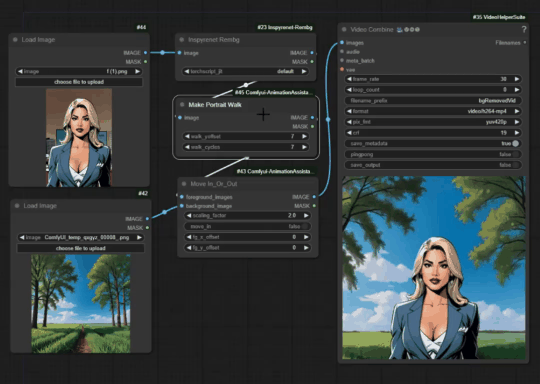
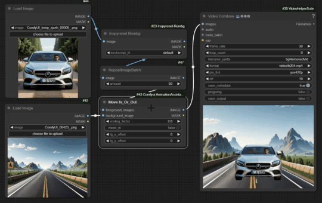
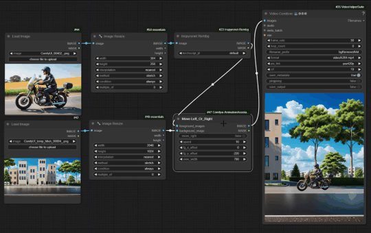
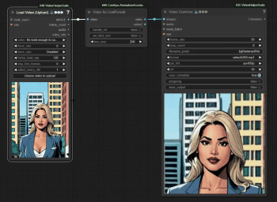

<!-- ## ComfyUI-Animation_Nodes_and_Workflows
These are ComfyUI custom nodes to assist in Animations and video compilations. -->

## Join Videos

The `Join Videos` node is for videos to video compilation. A node can take in up to 5 videos, and a combination of nodes can handle any number of videos with VRAM being the main limitation.

<div align="center">

 <br></br>

</div>

You can watch a video about this node [here](https://youtu.be/WiLun8E9T-E) 

## Replace Img_or_Vid_Bg

The `Replace Img_or_Vid_Bg` node is for replacing the background of images and videos. It is to be used with any background removal node.

<div align="center">

 <br></br>
</div>

## Make Portrait Walk

The `Make Portrait Walk` node receives a single portrait of a person and generates a batch of images that create the illusion of walking.

<div align="center">

 <br></br>
</div>

## Move In_Or_Out

The `Move In_Or_Out` node can be used to create the illusion of moving into or out of a place.

<div align="center">

 <br></br>
</div>

## Move Left_Or_Right

The `Move Left_Or_Right` node can be used to animate a background image to move right or left so that the foreground image looks like it's moving left or right.

<div align="center">

 <br></br>

</div>

## Move Up_Or_Down

The `Move Up_Or_Down` node can be used to animate a background image to move down or up so that the foreground image looks like it's moving up or down.

<div align="center">

 <br></br>
</div>

## Video for LivePortrait

The `Video for LivePortrait` node takes in a video of any size which contains a person and generates a 512x512 video of the person's face which can then be used as a driving video in Liveportrait (for face animation).

<div align="center">

 <br></br>
</div>

You can watch a video about this node [here](https://youtu.be/uEicKGu89mY)


## Installation

You can get these nodes by downloading this repository, extracting, and placing it in the custom_nodes folder of your ComfyUI directory. 
You might already have all the requirements installed in your comfyUI environment, but if not, then with your comfyUI environment opened in your CLI, you can navigate to custom_nodes/ComfyUI-Animation_Nodes_and_Workflows folder and install requirements as shown below.

```
pip install -r requirements.txt

```


If using a python-embedded environment, you can open your CLI in your '/custom_nodes/ComfyUI-Animation_Nodes_and_Workflows' folder and install the requirements as shown below.


```
..\..\..\python_embeded\python.exe -s -m pip install -r requirements.txt

```

You can restart comfyUI after the installation and start using the nodes. If you get any red node from the associated workflows, try installing the missing custom nodes with the comfyUI manager. If the nodes cannot be found, then check your CLI for any error. Also ensure you did not miss any step in the installation process. 
You can not yet install these nodes via the comfyUI manager. I will update this repository with the required information when that option becomes available.


**<font color=red> Note </font>**:


- >You can get the workflows from the animationWorkflows folder. The folder also contains animation workflows related to animatediff.

<!-- - >You can also connect a lineArt preprocessor to the LineArt2LineArt Assistant node and modify as you please.

- >You can install these nodes with the ComfyUI Manager. Search by entering:


     ```
     ComfyUI-Img2DrawingAssistants

     ``` -->


## Disclaimer
 
I am not responsible for any user-generated content. Users are fully responsible for their actions when using these nodes and workflows. I don't have any legal affiliation with or accountability for users' behaviors. It is crucial to use these nodes and workflows responsibly, following both ethical and legal standards.


